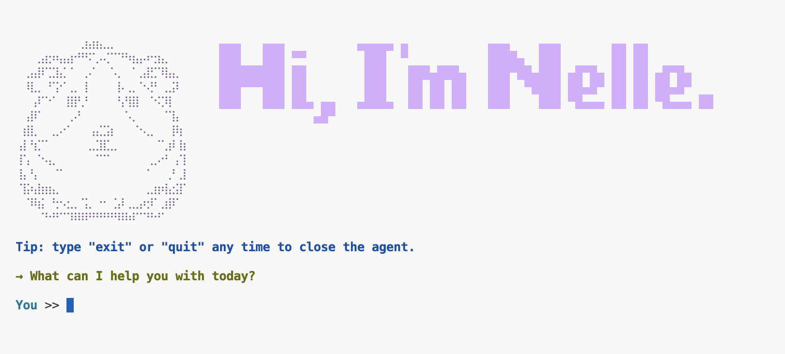

# Nelle - Agent Assistant

An autonomous agent built with the OpenAI Agents SDK. Nelle breaks down problems into checklists, executes each step, and reports progress with live-streamed styled terminal output.



## Features

- **Interactive Terminal UI**: Styled ASCII art and Rich live-rendered console output
- **Autonomous Task Planning**: Agent creates and manages checklists using function tools
- **Conversational Memory**: In-memory session persistence maintains context across multiple tasks
- **Live Streaming Output**: Real-time Rich markup rendering as the agent responds
- **Step-by-Step Execution**: Visual progress tracking with strikethrough for completed items

## Tech Stack

**Core Dependencies:**
- **Python 3.10+**
- **OpenAI Agents SDK** (`openai-agents==0.22.0`) - Agentic framework with built-in tool-calling loop, session management, and streaming
- **OpenAI API** (`openai>=1.0.0`) - Model access
- **Rich** (`rich>=13.0.0`) - Terminal formatting with live rendering
- **python-dotenv** (`python-dotenv>=1.0.0`) - Environment variable management

## Setup

1. **Create a virtual environment:**
   ```sh
   python3 -m venv .venv
   ```

2. **Activate the virtual environment:**
   ```sh
   source .venv/bin/activate
   ```

3. **Install dependencies:**
   ```sh
   pip install -r requirements.txt
   ```

4. **Configure environment:**
   Create a `.env` file in the project root:
   ```
   OPENAI_API_KEY=your_api_key_here
   MODEL_NAME=model-name
   ```

5. **Run the application:**
   ```sh
   python app.py
   ```

6. **To deactivate the virtual environment when done:**
   ```sh
   deactivate
   ```

## How to Use

1. Launch the application
2. Enter a task or problem when prompted
3. Watch Nelle break it down into steps and work through them in real-time
4. Enter another task, or type `exit` or `quit` to close

**Example prompts:**
- "Plan a dinner party for 8 people with a $200 budget"
- "Tell me a joke about software developers"

## Model Configuration

The model is set via the `MODEL_NAME` environment variable in `.env`. Change it to any model supported by your OpenAI API provider.

**Example:**
```
MODEL_NAME=model-name
```

## Architecture

### SDK-Powered Agent Pattern

This project uses the **OpenAI Agents SDK**, which abstracts away the manual tool-calling loop and message management into a high-level framework.

#### Core Flow

```
User Input → Agent (SDK) → Tool Calls → Tool Execution → Streaming Response
                ↑                                              ↓
                └──────────── Session persists ───────────────┘
```

#### Key Components

**1. Session Management (`SQLiteSession`)**
- In-memory SQLite session maintains conversation history automatically
- Conversation context persists across multiple tasks within one run

**2. Function Tools (`@function_tool` decorator)**
- Python functions decorated with `@function_tool` become agent tools
- SDK auto-generates schemas from function signatures and docstrings
- No manual JSON schema definitions needed

**3. Per-Turn State (`RunContextWrapper[ChecklistState]`)**
- Checklist progress (`items`, `completed`) lives in a `ChecklistState` dataclass
- A fresh `ChecklistState()` is created each loop iteration and passed to `Runner.run_streamed(..., context=...)`
- Tools declare `wrapper: RunContextWrapper[ChecklistState]` as their first argument, and the SDK injects the current turn's state automatically
- This keeps checklist data scoped to a single task

**4. Agent & Runner**
- `Agent` defines the agent's name, instructions, tools, and model
- `Runner.run_streamed` handles the entire tool-calling loop internally
- Streams response events as the agent works

**5. Live Streaming Output**
- `Rich.live.Live` re-renders accumulated output on each delta
- Markup tags parse against the full buffer for proper formatting
- User sees the response build in real-time

#### Design Principles

**SDK Abstraction**: The OpenAI Agents SDK eliminates boilerplate — no manual loop control, message formatting, or tool dispatch logic.

**Declarative Tools**: Decorate a function with `@function_tool` and it becomes available to the agent. The SDK handles schema generation and invocation.

**Conversational Continuity**: `SQLiteSession` tracks history automatically. The agent remembers prior tasks within the session without manual state management.

**Scoped Task State**: Checklist state rides in a per-run `context` object (`RunContextWrapper[ChecklistState]`) rather than shared globals, so it can't bleed between unrelated tasks while conversational history still persists in the session.

**Streaming UX**: Live-rendered output provides real-time feedback as the agent processes each step.

## Project Structure

```
app.py
├── Imports & Setup (OpenAI Agents SDK, Rich, dotenv)
├── Helper Functions (show)
├── Checklist State (ChecklistState dataclass: items, completed, report())
├── Function Tools (@function_tool decorated: create_checklist, mark_complete — receive state via RunContextWrapper[ChecklistState])
├── Welcome Banner (show_welcome)
├── User Prompt (prompt_user)
├── Main Loop (async main: fresh ChecklistState per task, SQLiteSession, Runner.run_streamed)
└── Entry Point (asyncio.run(main()))
```

## Observability

This agent demo includes ability to view agent traces:

<https://platform.openai.com/traces>

## Future Enhancements

- Persistent storage across sessions (swap `:memory:` for file-based SQLite)
- Support for sub-tasks and nested checklists
- Multi-agent collaboration (delegate subtasks to specialized agents)
- Token/message trimming for long conversations
- Tool result validation and error recovery

---

Built as a demonstration of SDK-powered agentic workflows with live streaming output.
