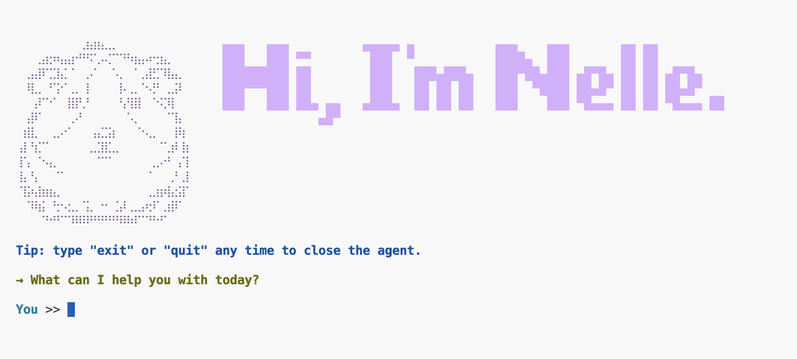

# Nelle - Agent Assistant

An autonomous agent built with the OpenAI Agents SDK. Nelle takes a natural-language request in the terminal, decides how deeply to dig, and streams the answer back live.



---

**For AI Agents/Assistants:** please read [CLAUDE.md](CLAUDE.md) for the virtual environment setup and Python command conventions.

## Features

- Chat with Nelle from your terminal — styled, streamed output.
- Nelle picks its own approach per turn: quick answer, a single web search, or a full multi-search research pipeline.
- Multi-turn memory within a session.
- Structured research reports with follow-up questions.

## Setup

1. Create and activate a virtual environment:
   ```sh
   python3 -m venv .venv
   source .venv/bin/activate
   ```
2. Install dependencies:
   ```sh
   pip install -r requirements.txt
   ```
3. Copy `.env.example` to `.env` and fill in `OPENAI_API_KEY`. Other settings have sensible defaults.
4. Run:
   ```sh
   python app.py
   ```

## Using Nelle

At the `You >>` prompt, type any request. Examples:

- `What is 5 + 5?` — direct answer.
- `Plan learning Python in 30 days` — plan.
- `What's the latest release of Python?` — single web lookup.
- `Research the latest AI agent frameworks` — full research pipeline (costs more).

Type `exit` or `quit` to leave.

## Traces

View runs in the OpenAI traces dashboard: <https://platform.openai.com/traces>. The workflow name is configurable via `TRACE_WORKFLOW_NAME` in `.env`.

## For contributors

Design notes, backlog, and per-epic specs live in [docs/ai/](docs/ai/).
